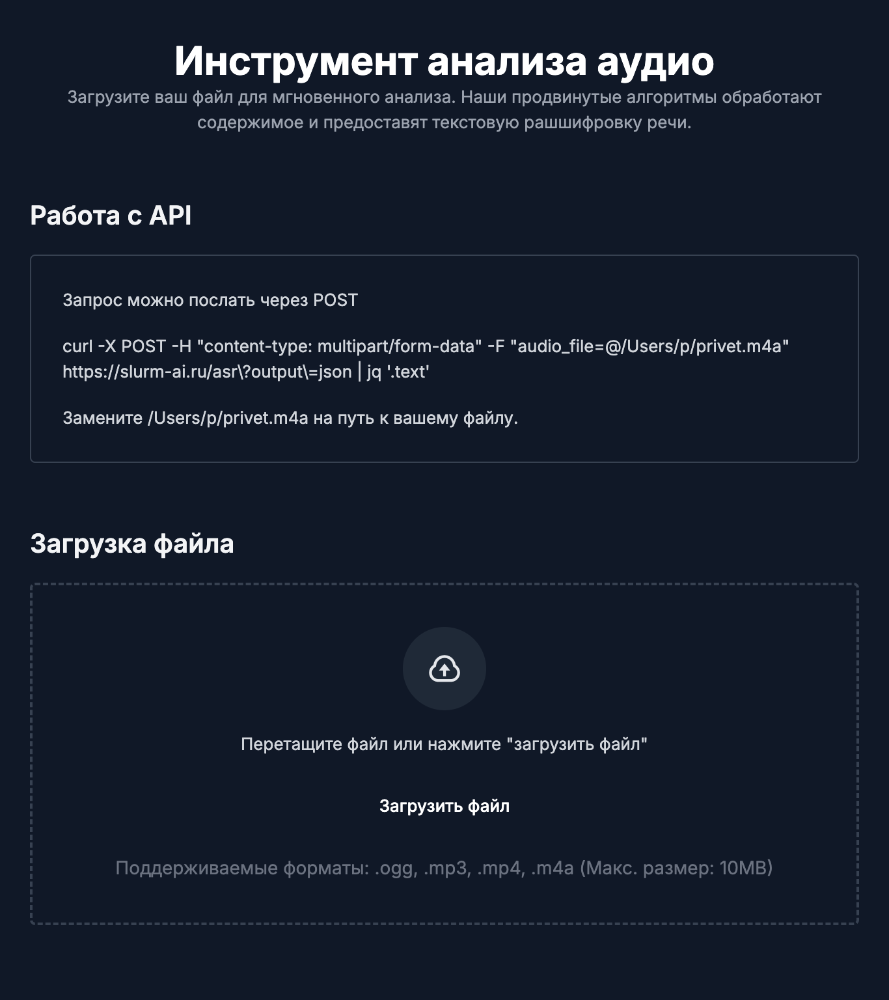

# AI-OPS-PLATFORM

Данный проект представляет из себя настройки и конфигурации, которые необходимы для реализации развертывания **production-ready kubernetes кластера**, а также **ASR (преобразование аудио файла в текстовый формат)** приложения в нем.

# Команда для тестирования
Заменить ```/home/p/privet.m4a``` на путь к своему аудио файлу
``` 
curl -X POST \ 
    -H "content-type: multipart/form-data" \
    -F "audio_file=@/home/p/privet.m4a" \
    https://slurm-ai.ru/asr?output=json | jq '.text'
```

# Структура проекта

## kubespray
Эта директория является частью инвентаря **Kubespray**, которая используется для настройки кластера **Kubernetes**. Здесь содержатся общие настройки для подготовки всего кластера.
## kubernetes
Директория kubernetes содержит конфигурацию для развертывания ingress-nginx используя Helm, а также зависимость Ansible коллекций для работы с Kubernetes.
## ai-app
Содержит манифесты, которые необходимы для развертывания и настройки приложения **AI(ASR Whisper)** на платформе Kubernetes.
 ## ai-frontend-extra
 Фронтенд, _нагенерированный IA_. Требует добаботки.
 Текущий функционал:
* Проверка формата загружаемого файла(mp3, mp4, ogg, m4a)
* Проверка размера файла(ограничение 10Мб)
